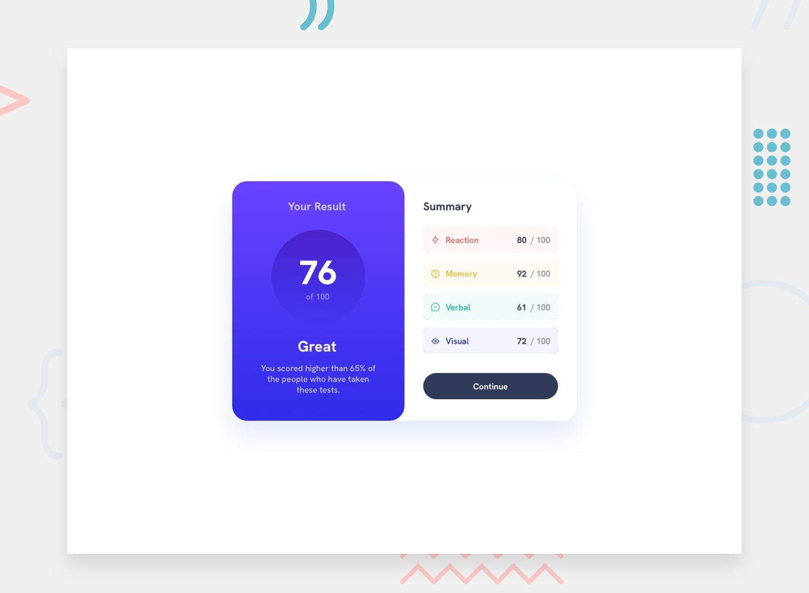

# Frontend Mentor - Results summary component solution

This is a solution to the [Results summary component challenge on Frontend Mentor](https://www.frontendmentor.io/challenges/results-summary-component-CE_K6s0maV).

## Table of contents

- [Overview](#overview)
  - [The challenge](#the-challenge)
  - [Screenshot](#screenshot)
  - [Links](#links)
- [My process](#my-process)
  - [Built with](#built-with)
  - [What I learned](#what-i-learned)
- [Author](#author)

## Overview

### The challenge

Users should be able to:

- View the optimal layout for the interface depending on their device's screen size
- See hover and focus states for all interactive elements on the page

### Screenshot

### Links

- Solution URL: [Solution](https://github.com/Pradeep743/Results-summary-component-Challenge)
- Live Site URL: [Visit site](https://pradeep743.github.io/Results-summary-component-Challenge/)

## My process

### Built with

- Semantic HTML5 markup
- CSS custom properties
- Flexbox
- Mobile-first workflow

### What I learned

I learnt about linear gradients, variable fonts, responsive layouts, flexbox and colour theories

## Author

- Frontend Mentor - [@Pradeep743](https://www.frontendmentor.io/profile/Pradeep743)
- LinkedIn - [@pradeepsahu074](https://www.linkedin.com/in/pradeepsahu074/)

